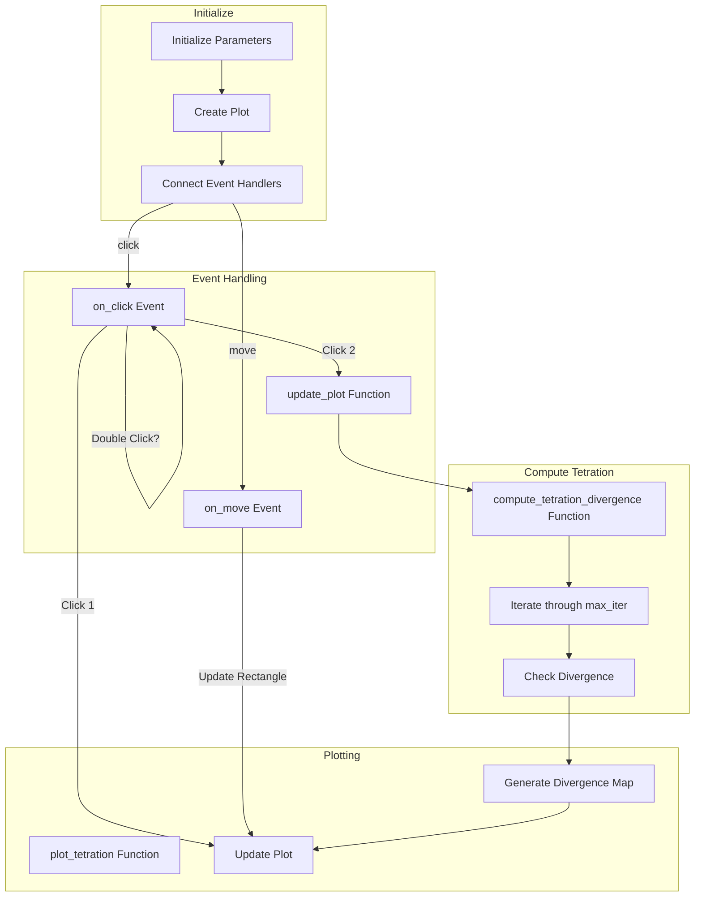

```mermaid
graph TD
    subgraph Initialize
        A1[Initialize Parameters]
        A2[Create Plot]
        A3[Connect Event Handlers]
    end

    subgraph Event Handling
        B1[on_click Event]
        B2[on_move Event]
        B3[update_plot Function]
    end

    subgraph Compute Tetration
        C1[compute_tetration_divergence Function]
        C2[Iterate through max_iter]
        C3[Check Divergence]
    end

    subgraph Plotting
        D1[plot_tetration Function]
        D2[Generate Divergence Map]
        D3[Update Plot]
    end

    A1 --> A2
    A2 --> A3
    A3 --> |click| B1
    A3 --> |move| B2
    B1 --> |Double Click?| B1
    B1 --> |Click 1| D3
    B1 --> |Click 2| B3
    B2 --> |Update Rectangle| D3
    B3 --> C1
    C1 --> C2
    C2 --> C3
    C3 --> D2
    D2 --> D3

```
